# Flex Trainer - Entity Relationship Diagrams

Complete ERD diagrams for the Flex Trainer gym management system database.

## Complete ERD (Mermaid)

```mermaid
erDiagram
    Users {
        int User_ID PK
        varchar First_name
        varchar Last_name
        varchar Username UK
        varchar Password
        varchar email UK
        date DOB
        varchar Role
    }

    Member {
        int Member_ID PK_FK
        int Gym_ID FK
        int Membership_ID FK
    }

    Trainer {
        int Trainer_ID PK_FK
        int Experience
        varchar Speciality
    }

    Admin {
        int Admin_ID PK_FK
    }

    Gym_Owner {
        int GymOwner_ID PK_FK
    }

    Gym {
        int Gym_ID PK
        varchar Gym_name
        varchar Gym_location
        int GymOwner_ID FK
    }

    Membership {
        int Membership_ID PK
        varchar Membership_name
        int Membership_duration
        decimal Membership_charges
    }

    Workout_Plan {
        int Plan_ID PK
        varchar Plan_name
        varchar Goal
        int Level
        decimal Charges
        int Creator_ID FK
    }

    Exercise {
        int Exercise_ID PK
        varchar Exercise_name
        varchar Focus_muscle
    }

    Machine {
        int Machine_ID PK
        varchar Machine_name
        int Exercise_ID FK
    }

    Diet_Plan {
        int Diet_ID PK
        varchar Diet_name
        varchar Diet_type
        varchar Diet_goal
        int Creator_ID FK
    }

    Meals {
        int Meal_ID PK
        varchar Meal_name
        varchar Meal_type
        decimal Protein
        decimal Carbohydrates
        decimal Fats
        decimal Fibre
        decimal Calories
    }

    Allergen {
        int Allergen_ID PK
        varchar Allergen_names
    }

    Feedback {
        int Feedback_ID PK
        int Rating
        text Review
        int Member_ID FK
        int Trainer_ID FK
    }

    Appointment {
        int Appointment_ID PK
        date Appointment_date
        time Appointment_start_time
        time Appointment_end_time
        varchar Appointment_status
        int Member_ID FK
        int Trainer_ID FK
    }

    Appointment_Requests {
        int Request_ID PK
        date Request_date
        time Request_start_time
        time Request_end_time
        varchar Request_status
        int Member_ID FK
        int Trainer_ID FK
    }

    Gym_Request {
        int Request_ID PK
        varchar Gym_name
        varchar Gym_location
        date Request_date
        varchar Request_status
        int GymOwner_ID FK
    }

    Trainer_Requests {
        int Request_ID PK
        date Request_date
        varchar Request_status
        int Trainer_ID FK
        int Gym_ID FK
    }

    System_Log {
        int Log_ID PK
        datetime Log_date
        varchar Activity_type
        varchar Table_affected
        int Record_ID
        int User_ID FK
        varchar Log_description
    }

    %% Relationships
    Users ||--o| Member : "is a"
    Users ||--o| Trainer : "is a"
    Users ||--o| Admin : "is a"
    Users ||--o| Gym_Owner : "is a"

    Gym_Owner ||--o{ Gym : "owns"
    Gym ||--o{ Member : "has"
    Member }o--|| Membership : "subscribes to"

    Users ||--o{ Workout_Plan : "creates"
    Users ||--o{ Diet_Plan : "creates"

    Trainer }o--o{ Gym : "works for"
    Trainer }o--o{ Member : "trains"

    Workout_Plan }o--o{ Exercise : "contains"
    Exercise ||--o{ Machine : "uses"

    Diet_Plan }o--o{ Meals : "includes"
    Meals }o--o{ Allergen : "contains"

    Member }o--o{ Workout_Plan : "accesses"
    Member }o--o{ Diet_Plan : "follows"

    Member ||--o{ Feedback : "gives"
    Trainer ||--o{ Feedback : "receives"

    Member ||--o{ Appointment : "books"
    Trainer ||--o{ Appointment : "has"

    Member ||--o{ Appointment_Requests : "requests"
    Trainer ||--o{ Appointment_Requests : "receives"

    Gym_Owner ||--o{ Trainer_Requests : "reviews"
    Trainer ||--o{ Trainer_Requests : "submits"

    Admin ||--o{ Gym_Request : "reviews"
    Gym_Owner ||--o{ Gym_Request : "submits"

    Users ||--o{ System_Log : "generates"
```

## Junction Tables Detail

```mermaid
erDiagram
    Works_For {
        int Gym_ID PK_FK
        int Trainer_ID PK_FK
    }

    Trains {
        int Trainer_ID PK_FK
        int Member_ID PK_FK
    }

    Workout_Exercise {
        int Workout_ID PK
        int Workout_sets
        int Workout_reps
        int Rest_intervals
        int Exercise_ID FK
        int Plan_ID FK
    }

    Diet_Meal {
        int Diet_ID PK_FK
        int Meal_ID PK_FK
    }

    Meal_Contains {
        int Allergen_ID PK_FK
        int Meal_ID PK_FK
    }

    Access_Workout_Plan {
        int Member_ID PK_FK
        int Plan_ID PK_FK
    }

    Access_Diet_Plan {
        int Member_ID PK_FK
        int Diet_ID PK_FK
    }

    Member_Joins_Gym {
        int Member_ID PK_FK
        int Gym_ID PK_FK
        date Join_date
        date Leave_date
    }

    Adds {
        int GymOwner_ID PK_FK
        int Trainer_ID PK_FK
        int Gym_ID FK
    }

    Previous_Trainer {
        int Trainer_ID PK_FK
        int Gym_ID PK_FK
        date Leave_date
    }
```



## User Hierarchy (Specialization)


## System Workflow Diagram


## Constraint Diagram

```mermaid
erDiagram
    Users {
        date DOB "CHECK: DOB <= GETDATE()"
        varchar Username "UNIQUE"
        varchar email "UNIQUE"
    }

    Membership {
        int Duration "CHECK: > 0"
        decimal Charges "CHECK: > 0"
    }

    Workout_Exercise {
        int Sets "CHECK: > 0"
        int Reps "CHECK: > 0"
        int Rest "CHECK: >= 0"
    }

    Meals {
        varchar Meal_type "CHECK: IN (Breakfast, Lunch, Dinner, Snack)"
        decimal Protein "CHECK: >= 0"
        decimal Carbs "CHECK: >= 0"
        decimal Fats "CHECK: >= 0"
        decimal Fibre "CHECK: >= 0"
        decimal Calories "CHECK: >= 0"
    }

    Feedback {
        int Rating "CHECK: BETWEEN 1 AND 5"
    }

    Appointment {
        time End_time "CHECK: > Start_time"
        varchar Status "DEFAULT: Scheduled, CHECK: IN (Scheduled, Completed, Cancelled)"
    }

    Gym_Request {
        date Request_date "DEFAULT: GETDATE()"
        varchar Status "DEFAULT: Pending, CHECK: IN (Pending, Approved, Rejected)"
    }

    Trainer_Requests {
        date Request_date "DEFAULT: GETDATE()"
        varchar Status "DEFAULT: Pending, CHECK: IN (Pending, Approved, Rejected)"
    }

    Appointment_Requests {
        date Request_date "DEFAULT: GETDATE()"
        time End_time "CHECK: > Start_time"
        varchar Status "DEFAULT: Pending, CHECK: IN (Pending, Approved, Rejected)"
    }
```



## Database Schema Summary

### Core Tables (29 total)

| Entity | Primary Key | Foreign Keys | Purpose |
|--------|-------------|--------------|---------|
| Users | User_ID | - | Base user table (all roles) |
| Member | Member_ID | User_ID, Gym_ID, Membership_ID | Gym members |
| Trainer | Trainer_ID | User_ID | Personal trainers |
| Admin | Admin_ID | User_ID | System administrators |
| Gym_Owner | GymOwner_ID | User_ID | Gym owners |
| Gym | Gym_ID | GymOwner_ID | Gym facilities |
| Membership | Membership_ID | - | Membership types |
| Workout_Plan | Plan_ID | Creator_ID (Users) | Exercise plans |
| Exercise | Exercise_ID | - | Individual exercises |
| Machine | Machine_ID | Exercise_ID | Gym equipment |
| Workout_Exercise | Workout_ID | Exercise_ID, Plan_ID | Plan-exercise junction |
| Diet_Plan | Diet_ID | Creator_ID (Users) | Nutrition plans |
| Meals | Meal_ID | - | Individual meals |
| Allergen | Allergen_ID | - | Food allergens |
| Diet_Meal | (Diet_ID, Meal_ID) | Diet_ID, Meal_ID | Plan-meal junction |
| Meal_Contains | (Allergen_ID, Meal_ID) | Allergen_ID, Meal_ID | Meal-allergen junction |
| Feedback | Feedback_ID | Member_ID, Trainer_ID | Trainer ratings |
| Appointment | Appointment_ID | Member_ID, Trainer_ID | Training sessions |
| Appointment_Requests | Request_ID | Member_ID, Trainer_ID | Appointment requests |
| Gym_Request | Request_ID | GymOwner_ID | Gym registration requests |
| Trainer_Requests | Request_ID | Trainer_ID, Gym_ID | Trainer registration requests |
| Trains | (Trainer_ID, Member_ID) | Trainer_ID, Member_ID | Trainer-member junction |
| Works_For | (Gym_ID, Trainer_ID) | Gym_ID, Trainer_ID | Trainer-gym junction |
| Access_Workout_Plan | (Member_ID, Plan_ID) | Member_ID, Plan_ID | Member plan access |
| Access_Diet_Plan | (Member_ID, Diet_ID) | Member_ID, Diet_ID | Member diet access |
| Member_Joins_Gym | (Member_ID, Gym_ID) | Member_ID, Gym_ID | Membership history |
| Adds | (GymOwner_ID, Trainer_ID) | GymOwner_ID, Trainer_ID, Gym_ID | Direct trainer additions |
| Previous_Trainer | (Trainer_ID, Gym_ID) | Trainer_ID, Gym_ID | Trainer archive |
| System_Log | Log_ID | User_ID | Audit trail |

## Cardinality Summary

| Relationship | Cardinality | Junction Table | Description |
|--------------|-------------|----------------|-------------|
| Users → Member | 1:0..1 | - | User can be a member |
| Users → Trainer | 1:0..1 | - | User can be a trainer |
| Users → Admin | 1:0..1 | - | User can be an admin |
| Users → Gym_Owner | 1:0..1 | - | User can be a gym owner |
| Gym_Owner → Gym | 1:N | - | Owner can own multiple gyms |
| Gym → Member | 1:N | - | Gym has many members |
| Member → Membership | N:1 | - | Many members per membership type |
| Trainer ↔ Gym | M:N | Works_For | Trainers work at multiple gyms |
| Trainer ↔ Member | M:N | Trains | Trainers train multiple members |
| Workout_Plan ↔ Exercise | M:N | Workout_Exercise | Plans contain multiple exercises |
| Diet_Plan ↔ Meals | M:N | Diet_Meal | Plans include multiple meals |
| Meals ↔ Allergen | M:N | Meal_Contains | Meals contain multiple allergens |
| Member ↔ Workout_Plan | M:N | Access_Workout_Plan | Members access multiple plans |
| Member ↔ Diet_Plan | M:N | Access_Diet_Plan | Members follow multiple diet plans |
| Member ↔ Gym | M:N | Member_Joins_Gym | Member gym history |
| Member → Appointment | 1:N | - | Member books multiple appointments |
| Trainer → Appointment | 1:N | - | Trainer has multiple appointments |
| Member → Feedback | 1:N | - | Member gives multiple feedback |
| Trainer → Feedback | 1:N | - | Trainer receives multiple feedback |

## Security Features

### Password Hashing
- All passwords stored as SHA256 hashes
- Hash verification on login via SP_User_Login
- PasswordHelper class in DatabaseHelper.cs

### SQL Injection Prevention
- 100% parameterized queries
- All 50+ input points secured
- Stored procedures for all database operations

### Input Validation
- ValidationHelper class with 8 validation methods
- Email format (RFC compliant)
- Password strength (minimum 8 characters)
- Username format (3-50 alphanumeric + underscore)
- Age validation (minimum 13 years)
- Positive number validation

### Audit Trail
- 49 triggers logging all operations
- System_Log table with complete history
- User_ID tracking for all actions

